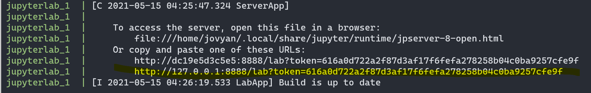

# Problema Productor-Consumidor | Proyecto Final
Es un problema de sincronización de multiprocesos. Hay dos tipos de procesos, productores y consumidores que consumen un buffer de tamaño limitado compartido.

En este proyecto los productores es dado por el archivo `compradores.csv`, los consumidores y el tamaño del buffer son definidos por el usuario a traves de un argumento en la linea de comando.

El programa tiene dos formas de ejecución; con alternancia y sin alternacia. Con alternancia los productores van a trabajar hasta llenar el buffer y después los consumidores van a trabajar hasta vaciarlo, sin alternacia los productores y consumidores van a correr en simultaneo.

## Instrucciones para correr
### Como notebook
1. Correr el siguiente comando:
```bash
docker-compose up
```
2. Acceder a Jupyter navegando al link que salga en la terminal  

3. Abrir el archivo `Untitled.pynb`

### Como CLI
1. Correr el siguiente comando:
```bash
docker-compose up
```
2. Correr lo siguientes comandos
```bash
pip i -r requirements.txt 

python Prodconsumidor.py buffsize=5 productores=5 consumidor=./notebooks/data/compradores.csv alternancia=0 debug=0
```

### Abrir base de datos
1. Navegar a `http://localhost:8383/`
2. Usar la siguientes credenciales:  
  a. Server = mysqldb  
  b. Username = root  
  c. Password = 123  
  d. Database = finaldb  

3. Cliquear en '`SQL Command`'

## Para responder preguntas
Después de correr el programa y acceder al administrador de la base de datos correr los siguientes queries:
### 1. Cuantos leads compró cada consumidor 
```sql
select distinct(comprador),count(*) from buyers group by comprador
```
### 2. Cuantos leads creó cada productor 
```sql
select distinct(productor_id),count(*) from leads group by productor_id
```
### 3. Cuanto tiempo promedio se tardó cada productor en producir un elemento 
```sql
select 
productor_id,
((max(fechahora_ingesta)-min(fechahora_ingesta))/count(*))
from leads
group by
productor_id
```
### 4. Cuanto tiempo le lleva a todo el sistema terminar de producir y consumir 
```sql
select 
(max(c.fechahora_ingesta)-min(p.fechahora_ingesta))
from buyers as c inner join leads as p on (c.lead_id=p.id)
```
### 5. Cuanto tiempo tarde en terminar el sistema en un modelo de alternancia 
```sql 
select 
(max(c.fechahora_ingesta)-min(p.fechahora_ingesta))
from buyers as c inner join leads as p on (c.lead_id=p.id)```